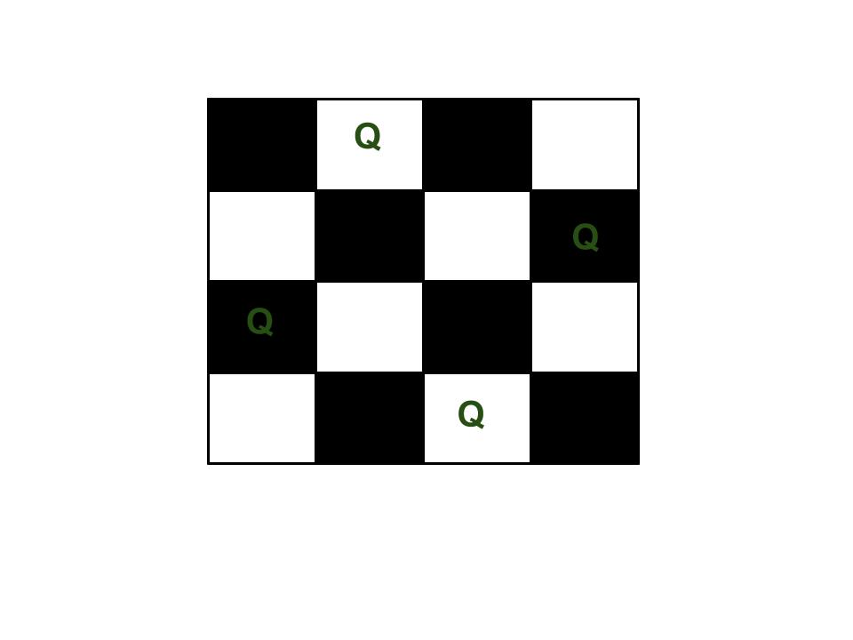

# N-Queen-Problem-
# Implementation of Backtracking solution
The N Queen is the problem of placing N chess queens on an N×N chessboard so that no two queens attack each other.
For example, following is a solution for 4 Queen problem.

How to run?
1. Download a C file
2. Enter the solution number you want. Table 8X8 has 92 solutions.

In this solution - assume Table 8X8 so there are only 92 solutions

The expected output is a binary matrix which has 1s for the blocks where queens are placed

For example, following is the output matrix for above 4 queen solution.

              { 0,  1,  0,  0}
              { 0,  0,  0,  1}
              { 1,  0,  0,  0}
              { 0,  0,  1,  0}
